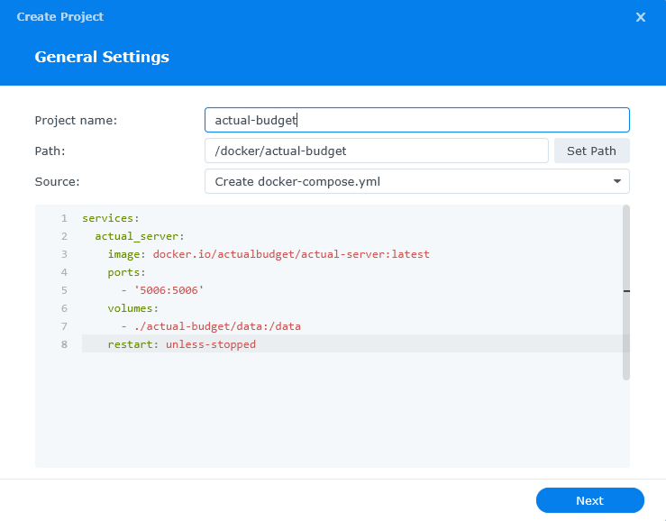

# Install Actual Budget on Synology

This guide uses Synology's native Docker manager, [Container Manager](https://www.synology.com/en-us/dsm/feature/docker). This avoids Portainer which is used in [Marius' guide](https://mariushosting.com/how-to-install-actual-on-your-synology-nas/), but is essentially the same [official install process](https://actualbudget.org/docs/install/docker) through Docker on any other system.

## Prerequisites

- [DiskStation Manager (DSM) 7.2+.](https://www.synology.com/en-us/dsm). If you have an up-to-date Synology device you should be good to go.
- [Container Manager](https://www.synology.com/en-us/dsm/feature/docker). Can be installed from [Package Center](https://kb.synology.com/en-ph/DSM/help/DSM/PkgManApp/PackageCenter_desc?version=7) in <abbr title="DiskStation Manager">DSM</abbr>.

## Prepare Project Folder

1. Open File Station.
1. Navigate to the directory where you'd like to store Actual Budget. This is up to the user to decide, but something like `/docker/` is common.
1. Click `Create` button and select `Create folder`. Name the folder anything -- `actual-budget` is fine.
1. Navigate into this Project Folder, click `Create` button and select `Create folder`. This time, name it `data`.

## Create Project

1. Open Container Manager.
1. Click `Project` tab to open the Project view.
1. Click `Create` button to create a new Project.
   - `Project name`: This can be anything -- `actual-budget` is fine here too. It doesn't have to match the folder.
   - `Path`: Click `Set Path` and select the folder you created in Prepare Folder.
   - `Source`: Select `Create docker-compose.yml`.

## Adjust `docker-compose`

Actual provides a [docker-compose file](https://github.com/actualbudget/actual/blob/master/packages/sync-server/docker-compose.yml) you can use at their GitHub repo. Here, I'll provide the minimum version you need to get up and running.

You can customize your `docker-compose.yml`, but I'll also provide the minimum required mappings to get you going. If you feel like you want to dig deeper, check out the other [server configuration options](https://actualbudget.org/docs/config/).

### Setup YAML

Copy and paste this into the Conatiner Manager `docker-compose.yml` area:

```yaml
services:
  actual_server:
    image: docker.io/actualbudget/actual-server:latest
    ports:
      - "5006:5006"
    volumes:
      - ./actual-budget/data:/data
    restart: unless-stopped
```

You can edit this YAML in the Container Manager editor, and the output will be saved to your Project Folder after the Project is saved (you can always go edit this later!).

#### Required changes

The only variable you _must_ change is the `volumes` argument. This is made up of your local path (`./actual-budget/data` in this YAML) and the mapped location in Actual (`/data` in this YAML). You'll need to replace `./actual-budget/data` with the full path to the `data` folder you created in your Project Folder.

For example, if you made your folder at `/docker/actual-budget/data` on a basic Synology setup, your `volumes` argument should be `- /volume1/docker/actual-budget/data`.

### Optional changes

-`image`: This is where the Actual Budget Docker image is sources from. The default is from Docker hub, but you can switch this to `ghcr.io/actualbudget/actual` to use GiHub's container registry. They both function exactly the same way.

-`ports`: The default port is `5006`. This means you'll visit `https://<your-nas-ip>:5006` to use Actual. You can switch the first port to change it -- if you want port `1234`, set this to `'1234:5006'`.

-`restart`: The `unless-stopped` rule means that Actual Budget will try to restart unless you specifically stop the container. Other options are [here](https://github.com/compose-spec/compose-spec/blob/main/spec.md#restart) but you probably want the default.

Again, you can dive deeper into the [server configuration options](https://actualbudget.org/docs/config/), but the above options are all that are required.

## Finish Project

1. Once your YAML is all set up, click `Next` button.
   
1. [Web Portal](https://kb.synology.com/en-uk/DSM/help/WebStation/application_webserv_virtualhost?version=7) is not necessary. If you don't know what it is, just click `Next`!
1. Confirm everything looks good in the Summary. You can check `Start the project once it is created`, then click `Done`.
1. Visit the web interface wherever you set it up (`https://<your-nas-ip>:5006` most likely) to ensure it works.

## Troubleshooting

This installation is pretty basic, so if the web UI isn't working then it's probably an error in your `docker-compose.yaml`.

1. Did you create a `data` folder inside your Project Folder?
1. Did you correctly add the path to `data` in the `volumes` part of the YAML?

If both of these are true, then you have a problem elsewhere in your Synology setup.
